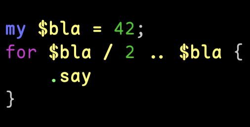

[](https://github.com/FCO/Highlight-Terminal/actions)

NAME
====

Highlight::Terminal - Highlight code using terminal colors

SYNOPSIS
========

```raku
use Highlight::Terminal;

say Q"my $bla = 42; for $bla/2 .. $bla { .say }".AST.DEPARSE: Highlight::Terminal;
```



DESCRIPTION
===========

Highlight::Terminal is a way to highlight Raku code using `RakuAST` and terminal colors.

AUTHOR
======

Fernando Corrêa de Oliveira <fernando.correa@humanstate.com>

COPYRIGHT AND LICENSE
=====================

Copyright 2024 Fernando Corrêa de Oliveira

This library is free software; you can redistribute it and/or modify it under the Artistic License 2.0.

